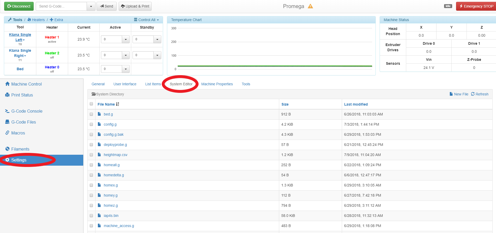

# \*Help! My Drives / Tools are Backwards

Whenever you are changing or updating configuration files it is possible that your drives will be wrongly configured. This could result in your extruder drivers going the wrong way, or Drive 2 spinning when you want Tool 1 to be extruding.

## Flipping Extruder Directions

This will fix extruder drives that are going backwards. For example if you pressed the button _Extrude_ on the Duet Web Console it will result in the drive pushing filament back out of the extruder hole as if you were retracting. **Heads-up read the information box below.** 


It is possible that your extruder directions are flipped because the extruder drives are flipped, meaning the 4-pin Dupont connector is backwards on the Duet Board. Try flipping the connector and seeing if the issue is resolved.


1. Connect to the Crane's Duet Web Console
2. To check your extruder directions go to the _Machine Control_ tab in the Duet Web Console and select drive 0 or 1 in _Extruder Control._ Then try to feed filament into the extruder and see if your directions are correct. It is also possible to change the extruder drives in the section below. If your filament is being pushed out of the top of the extruder when you press extrude, follow the steps below.   
3. Go to the _Settings_ tab of the Duet Web Console and then to the _System Editor._   
4. Open the _config.g_ file. Find the block with the following commands: `; --- SECTION: DRIVES (MOVEMENT SECTION) ---`
5. `; Drives  M569 P0 S1 ; Drive 0 goes forwards, Tool 0   M569 P1 S0 ; Drive 1 goes backwards, Tool 1   M569 P2 S0 ; Drive 2 goes backwards, Tool 2   M569 P3 S1 ; Drive 3 goes forwards, Tool 3`  
6. Depending on which drive is going backwards change that drive's direction with the `S` parameter. For example, if Drive 3 was going backwards, I would change the command to go from `M569 P3 S1`

   to`M569 P3 S0.`

7. Save the file and reboot the system. Repeat step 2 to confirm that the directions are correct.

## Flipping Extruder Drives

This section will fix extruder drives that are flipped. If you actuate what you think is the one drive and it results in a different drive spinning. 


**The inherent problem here lies in wiring, so be aware, the fix you are applying requires the printer to be off.**


 The wiring is intended to have Drive 0 \(Tool 0\) wired to extruder drive 0, Drive 1 \(Tool 1\) to extruder drive 1, and so on. To fix this permanently fix the wiring of your QuadFusion.

1. Connect to the Printer's Duet Web Console
2. To check your extruder drives go to the _Machine Control_ tab in the Duet Web Console and select Tool 0, 1, 2, or 3 in _Extruder Control._ If you have Tool 0 selected and press extrude it should move the Drive 0. For Tool 1, Drive 1 should move.  It is also possible to change the extruder drives in the section below.
3. Now that you have pinpointed which Tools are switched, turn your printer off.

As an example, let's say that when you try to extrude Tool 1, you instead trigger Drive 3 which sends the wrong color and vice versa. To fix this all you need to do is flip the connectors for Drive 1 and Drive 3.


**Remember,**  Drive 0/ Tool 0 connects to Extruder Drive 0,  Drive 1 / Tool 1 connects to Extruder Drive 1,  Drive 2 / Tool 2 connects to External Drive 2, Drive 3 / Tool 3 connects to External Drive 3 


If you are unclear which wire connects to which port, go to the [Duet Maestro Wiring](../electrical-guides/duet-maestro-wiring.md) guide for help.

