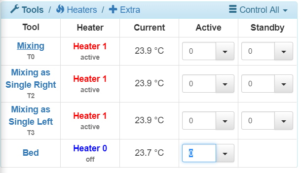

# \(Edit pictures\) Loading and Unloading Filament

## Loading Filament

1. Heat up the nozzle to the temperature required for the specific filament you are about to load \(ABS-R: ~230C, PLA: ~200C\). Use the Duet Web Console's Tools/Heaters/Extra table to heat up the specific nozzle. For more guidance on heating up your nozzle, follow [this guide.](https://m3d.gitbook.io/promega-docs/getting-started/heating-the-bed-and-nozzles)

   

2. Send filament through the entrance of the PTFE tubes located at the back of the printer.

   

   The filament will go through the cable chain housing and come out at the end of the cable chain at the extruder assembly. It is not necessary to feed the filament through the filament tubes in order to print.

3. Guide the filament into the holes in the extruder \(pictured below\). Push the filament about one inch down so you are pressing the filament against an extruder gear located inside. You can unclip the PTFE tube holders if necessary.

   

4. **If you are using the compound nozzle you must load filament into both sides of the extruder or use the PC plug included.** You must load filament into both sides of the extruder at the same time. If you load filament on only one side, pressure will force molten plastic up the other side of the extruder!
5. Go to the Duet Web Console's _Machine Control_ section and find the _Extruder Control_ tab. The first few buttons define which extruder drives to use, the next set define the length of filament, the final set the feedrate. For loading filament select the 50mm or 10mm button as well as the 5mm/s button. If you are loading filament into a compound nozzle select _Mix_, for a K'Tana select the proper extruder drive \(0 or 1\).

   

6. Once your nozzle has reached temperature, press the _Extrude_ button until filament is coming out of the nozzle. **Skipping at a feedrate of 5mm/s is normal**, you can reduce the feedrate to 1mm/s to avoid skipping.
7. You have now successfully loaded filament, be sure to clip the PTFE tubes back into place on the extruder. Remove any ooze or printed filament before printing.


If you turn your extruder motors off so that they are not holding their position with idle current. You can push the filament through the extruder and right into the hot-end. This makes it possible to manually load filament without powering your extruder motors. **Remember that powering off your motors with the** `M84` **command will power off** _**all**_ **motors and could cause your bed to drop.**


## Unloading Filament

1. Heat up the nozzle to the temperature required for the specific filament you are about to unload \(ABS-R: ~230C, PLA: ~200C\). Use the Duet Web Console's Tools/Heaters/Extra table to heat up the specific nozzle. For more help on heating up components follow [this guide.](https://m3d.gitbook.io/promega-docs/getting-started/heating-the-bed-and-nozzles)

   

2. * Using the _Extruder Control_ Tab under _Machine Control_ set the filament distance and feedrate to 100mm and 60mm/s respectively. Set the extruder drive buttons to the extruders for which you want to unload filament. For the compound nozzle, select _Mix_. Press _Retract_ until the filament is free to be pulled out by hand.
     * It is also possible to unload the filament by hand, without using the motors. This can only be done if your motors are unpowered and the nozzle has reached temperature. To disable the idle current on your extruder motors, send the command `M84`. Remember that this command will disable the idle current of **all** motors. The bed may drop down. Once the extruder motors are powered off, firmly grasp the filament and pull up. In one fast and smooth motion you will be able to pull your filament out.    
3. You have now successfully unloaded filament from the printer.

Continue on to the [Z-Probe Calibration](https://m3d.gitbook.io/promega-docs/getting-started/z-probe-calibration) guide, the next chapter in the [Getting Started](https://m3d.gitbook.io/promega-docs/getting-started) guide.

