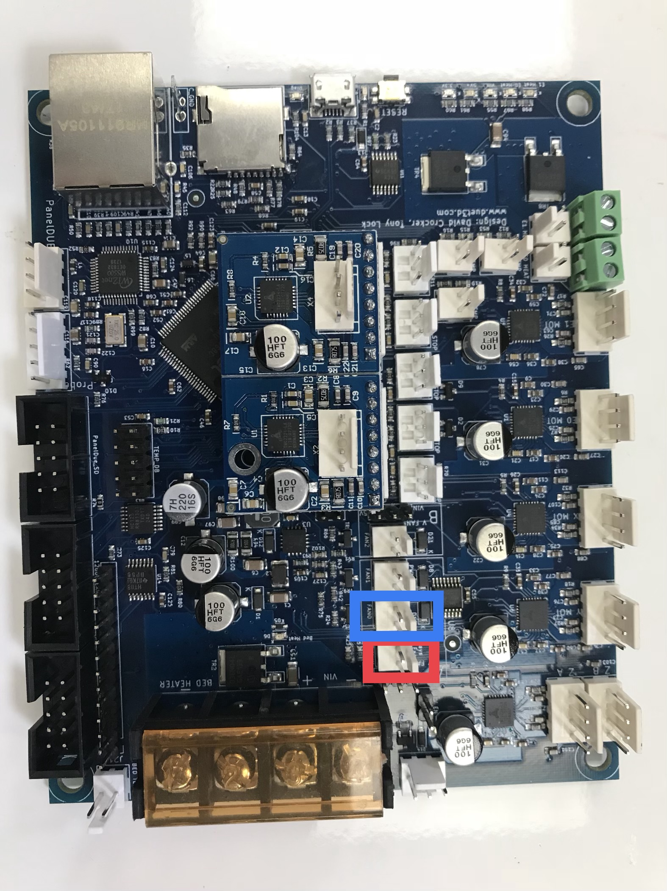
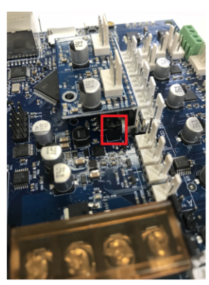

# Duet Maestro Wiring

This guide covers the wiring of the Crane along with possible wiring solutions to problems. Properly understanding the wiring of the Crane is extremely important. Shorting the Duet Maestro board can be done easily. Follow and acknowledge the warnings listed in [Critical Warnings](https://m3d.gitbook.io/promega-docs/getting-started/critical-warnings-and-information). The Duet Maestro board can be easily damaged or broken by:

1. Wiring the board incorrectly and causing a short
2. Electro-static Discharge
3. Generating too much voltage by manually moving motors
4. Plugging in and unplugging components while the system is powered
5. Touching electrical components while the system is powered

## Wiring Guide

### Duet Maestro Ports

The image above displays the ports found on the Duet Maestro and their functions.

Before you can begin to wire your QuadFusion to the Duet Maestro board you must attach an extension to the board. With this extension you will be able to connect the the extra motor wires to the board.

The following pictures show where the extension goes, and how it looks once it has been plugged in:

### Base Connections

Without the fans, the QuadFusion has six main wires coming from it. The four wires with yellow dots at the ends are the motor wires. The wire with a green dot is the heater wire, and lastly the wire with the red dot is the PT1000 \(or thermistor\).

The wires plug in to their corresponding color that is boxed in the following picture:

Notes:

* Keep in mind when you're wiring your QuadFusion's motors to the Duet Maestro board which motor is connected to which port. The first picture in this guide labels each port as E0 Stepper, E1 Stepper, E2 External Driver, and E3 External Driver. When facing the front of your QuadFusion, the front left motor is 0, the front right motor is 2, the back left motor is 1, and the back right motor is 3. 
* If you decide to extend the wires given to you, make sure that you are maintaining the original positive and negative wires. 

**Connecting the fans**

There are three fans connected to the QuadFusion, two small fans on the left and right and one large fan on the front. The large fan on the front is Fan 0, or "Always On", the two side fans are connected to one another and make up Fan 1 \(whose speed can be controlled in the Duet Web Control\).

In the picture below, the red box indicates where Fan 0 should be plugged in, and the blue box is where Fan 1 is to be plugged in.

### Crane Resistance Table

The Crane electrical components have specific resistances attributed to them. This can make troubleshooting components much easier. With a multi-meter set to measure resistance, you can measure the resistance of a thermistor or heater and compare the reading with the values in the table below. Whenever you are working with electrical components we recommend you switch off the power to the Duet board!

**Resistance Table**

| Component | Expected Value \(Ω\) |
| :--- | :--- |
| Extruder PT1000 | 1090\* Ω |
| Extruder Heater | 13.1 Ω |
| Bed | 2.2 Ω |
| Bed Thermistor | 106800\* Ω |
| Extruder Stepper Motor | 19.3 Ω |
| Axis Stepper Motor | 9.0 Ω |

\*Remember that the resistance of a thermistor is dependent on temperature and will vary from this reading! Thermistor resistance values listed above were taken at room temperature \(~24 C\)

### Jumpers

You might notice that your Duet Maestro board for the Crane came with several jumpers on the board. In case you are not familiar with what a jumper is, it represents a connector bridging two electrical components or signals. Read this for more about jumpers: \[Wikipedia: Jumpers\]\([https://en.wikipedia.org/wiki/Jumper\_\(computing](https://en.wikipedia.org/wiki/Jumper_%28computing)\)\). Your Duet should have 5 different jumpers, located as seen in the image below.

Jumpers:

1. Allows for internal 5V power when Vin \(24V\) is connected
2. Fan voltage jumper, B FAN2, set to 5V for nozzle fan
3. Fan voltage jumper, A Always-on-fan set to Vin for cold-section fan
4. and 5. Only one Z-motor on the Crane, so jumpers are required to properly connect Z-motor to the stepper motor driver.


You will need Jumper \#1 in order to connect the third and fourth motor from the QuadFusion to the Duet Maestro


The pictures below depict where the jumper needs to go, and how it looks once it is there:

### Before you continue

If you change the wiring of your printer it is best to proceed with the following steps before continuing to prevent damage.

1. Double check the wiring of every single wire you changed. 
2. Plug in the power supply while the printer is switched **off**. 
3. Turn the printer on 
4. Connect to the Duet Web Console 
5. Verify the temperature readouts of all heating components. 
6. Test each component individually
   1. Move each motor independently and confirm that it is travelling in the correct direction.
   2. Heat up your nozzle\(s\)
   3. Heat up your bed
   4. Press each limit switch
7. You should be ready to go!

### Extra Resources:

There is way more to the electronics of the Duet Maestro board. Follow the links below for more help and information regarding the Duet Maestro.

1. [Duet Maestro Pinout](https://duet3d.dozuki.com/Wiki/Duet_2_Maestro_Wiring_Diagram) 
2. [Duet Maestro Hardware Overview](https://duet3d.dozuki.com/Wiki/Duet_2_Maestro_Hardware_Overview#Section_Wiring_and_pinout) 
3. [M3D Support](https://printm3d.com/support) 
4. [Duet3D forum](https://forum.duet3d.com/): A great place for very specific Duet Maestro and RepRap firmware questions

